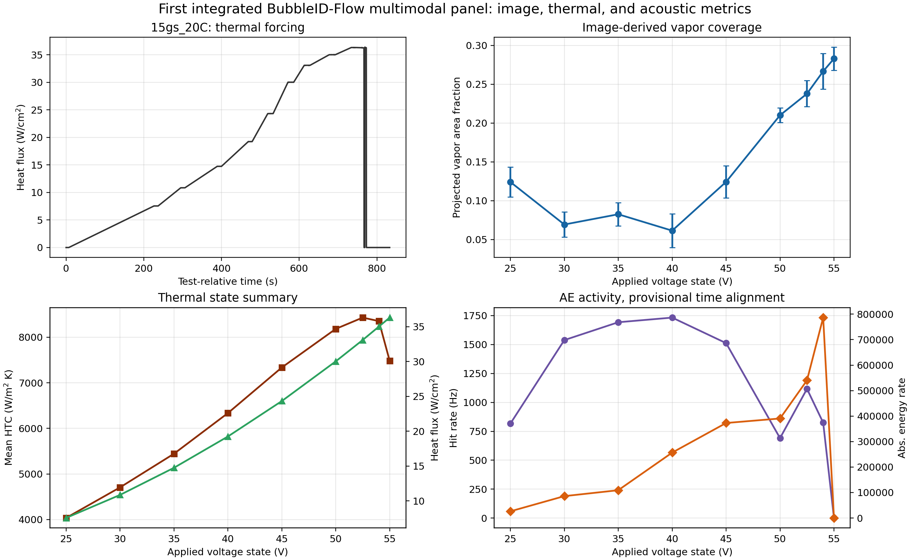
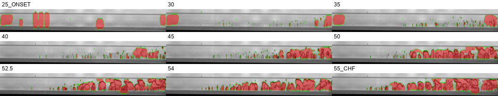
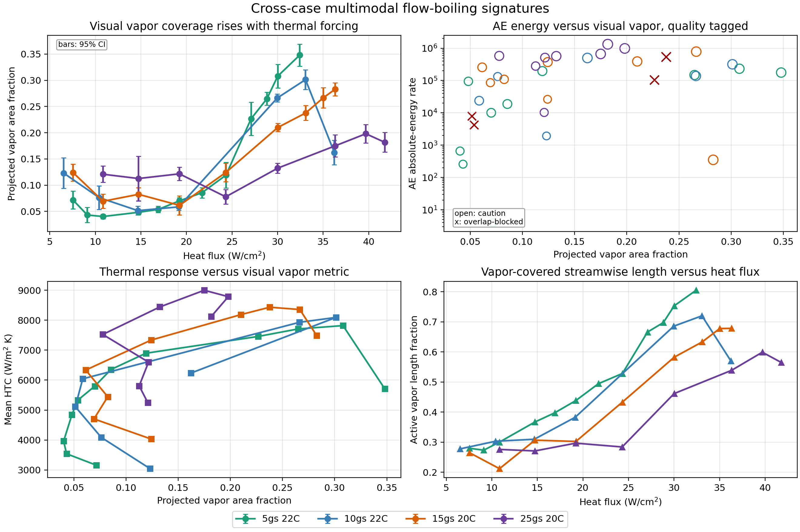
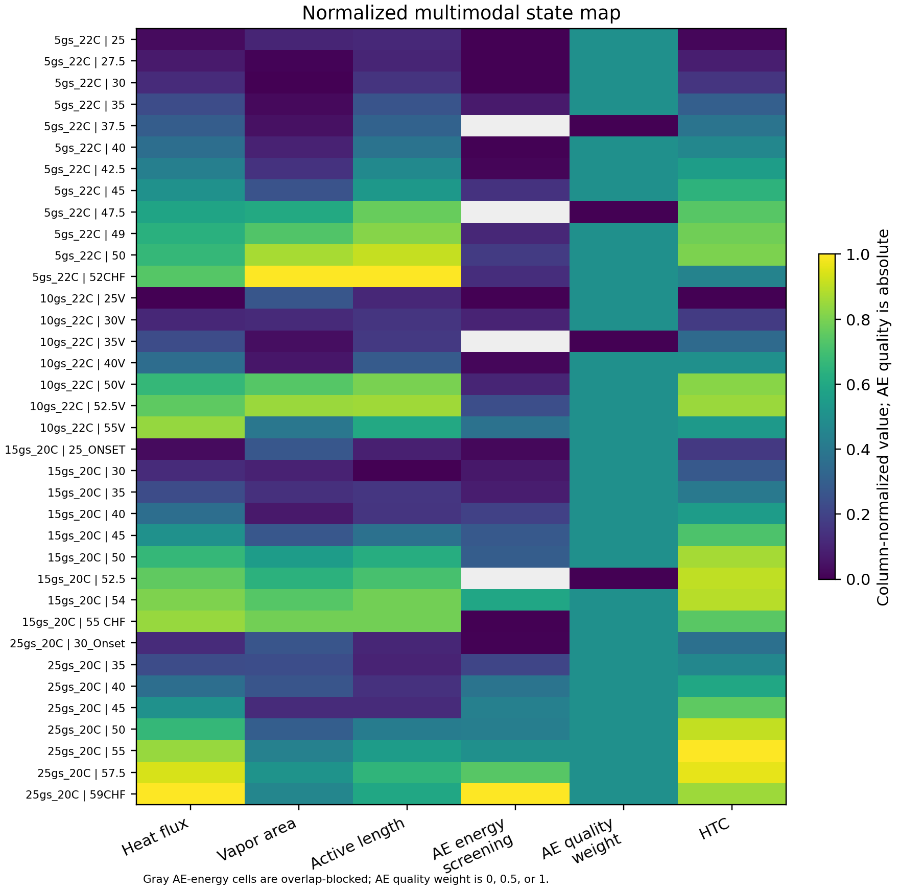

# Multimodal Optical, Thermal, and Acoustic Diagnostics of Flow Boiling Using BubbleID-Flow

## Authors

Mohammad Ishraq Hossain, Daniel Curl, Farshad Barghi Golezani, Han Hu, and collaborators.

## Draft Status

This is an initial working manuscript draft prepared from the current BubbleID-Flow repository outputs. It is intended to establish the paper narrative, section order, figure logic, and first-pass quantitative claims. Citations, sensor geometry, uncertainty, and synchronization details require verification before journal submission.

## Abstract

Flow boiling can dissipate high heat fluxes in compact thermal systems, but its coupled vapor, thermal, pressure, and acoustic signatures make regime evolution difficult to diagnose from a single measurement stream. This work develops an initial multimodal analysis workflow that combines high-speed optical images, reduced thermal-fluid measurements, and acoustic-emission hit features from heated microchannel flow-boiling experiments. BubbleID-Flow, a flow-boiling adaptation of the BubbleID computer-vision workflow, is used to segment near-wall vapor structures with a fine-tuned Detectron2 Mask R-CNN model and to compute projected vapor area fraction and active vapor length in a streamwise region of interest. These optical metrics are fused with heat flux, heat-transfer coefficient, pressure-drop-related quantities, and acoustic-emission hit and absolute-energy rates for four operating cases spanning nominal mass flow rates of 5, 10, 15, and 25 g/s and inlet subcoolings of 20 to 22 degC. In the baseline 15 g/s case, projected vapor area fraction increases from approximately 0.061 to 0.283 as heat flux increases from approximately 7.55 to 36.30 W/cm2. Across the four cases, vapor coverage and vapor-covered streamwise length generally increase with thermal forcing, while acoustic absolute-energy rate broadly increases with image-derived vapor activity but exhibits case-specific scatter. The results demonstrate that a reproducible optical-thermal-acoustic workflow can connect visible vapor morphology with heat-transfer response and nonintrusive acoustic signatures. The present draft treats acoustic timing and absolute magnitude cautiously because trigger synchronization and acoustic sensor coupling still require audit.

## Keywords

Flow boiling; acoustic emission; computer vision; BubbleID; Mask R-CNN; vapor area fraction; multimodal diagnostics; heat transfer.

## 1. Introduction

Flow boiling is a central heat-transfer process for compact thermal management because phase change can transport large heat loads with comparatively small temperature differences. In electronics cooling, spacecraft thermal control, and high-power energy systems, the ability to identify onset, developed boiling, intermittent vapor activity, and critical-transition behavior is essential for both performance and safety. The diagnostic challenge is that the observable response is inherently coupled: vapor morphology changes the local heat-transfer coefficient, pressure drop responds to evolving two-phase structure, and wall temperature histories depend on both the imposed heat input and the spatial distribution of liquid-vapor contact.

Conventional flow-boiling studies often emphasize thermal measurements, pressure response, or high-speed visualization as separate analysis channels. Thermal data quantify heat flux, wall superheat, and heat-transfer coefficient, but do not directly reveal whether a change in heat-transfer behavior is associated with vapor spreading, coalescence, dryout, or intermittent rewetting. Optical images reveal vapor morphology, but image-only analysis can underuse simultaneous heat-transfer and acoustic measurements. Acoustic-emission sensing offers a nonintrusive window into interfacial activity and structure-borne disturbances, but acoustic features are difficult to interpret unless they are grounded in visible vapor behavior and the corresponding thermal state.

Recent progress in computer vision has made it possible to convert high-speed boiling images into quantitative descriptors of bubble and vapor morphology. Autonomous vision tools, including bubble-mask and learning-based segmentation workflows, can extract features such as vapor coverage, bubble size, bubble count, and vapor-front position from large image sequences. These tools are especially valuable when manual analysis becomes impractical. However, computer vision alone does not close the diagnostic loop: a physically useful boiling indicator should connect the visual state to heat-transfer performance and, when possible, to non-optical signals that remain available when visual access is limited.

The present work is motivated by that gap. We develop an initial multimodal workflow that fuses high-speed image segmentation, reduced thermal-fluid measurements, and acoustic-emission features for October 17, 2025 CWRU Test 17 flow-boiling data. The optical component is BubbleID-Flow, a repository-level adaptation of BubbleID for flow-channel images. The thermal component is based on reduced workbooks containing heat flux, power, pressure, subcooling, local wall temperatures, quality estimates, and heat-transfer coefficients. The acoustic component uses EasyAE hit tables to compute hit-rate and absolute-energy features over operating-state windows.

This first manuscript draft makes three contributions. First, it establishes a reproducible analysis pipeline that maps raw high-speed images to projected vapor metrics and fuses those metrics with thermal and acoustic summaries by operating state. Second, it demonstrates the workflow on a baseline 15 g/s, 20 degC-subcooling case and shows that projected vapor area fraction rises strongly as heat flux approaches a CHF-adjacent condition. Third, it compares four flow-rate/subcooling cases to show where optical vapor metrics, heat-transfer response, and acoustic-emission energy agree and where they diverge. The paper is framed as an initial diagnostic workflow rather than a finalized regime classifier because image/thermal/acoustic synchronization, manual segmentation validation, and acoustic coupling uncertainty remain open.

## 2. Experimental Data

### 2.1 Flow-Boiling Test Matrix

The analysis uses CWRU Test 17 data collected on October 17, 2025 in a heated microchannel two-phase flow loop. The working fluid is deionized water. Four operating cases are included in the current manuscript dataset, as summarized in Table 1. The raw data streams include high-speed optical images, reduced thermal/flow workbooks, and acoustic-emission hit files.

**Table 1. Operating cases used in the current multimodal analysis.**

| Case label | Nominal mass flow rate | Nominal inlet subcooling | Test folder | Image-state labels |
| --- | ---: | ---: | --- | --- |
| `5gs_22C` | 5 g/s | 22 degC | `2` | 25 to `52CHF` |
| `10gs_22C` | 10 g/s | 22 degC | `1` | `25V` to `55V` |
| `15gs_20C` | 15 g/s | 20 degC | `3` | `25_ONSET` to `55 CHF` |
| `25gs_20C` | 25 g/s | 20 degC | `4` | `30_Onset` to `59CHF` |

The state labels correspond to applied-voltage or transition-state folders in the image archive. For example, the 15 g/s case includes onset, intermediate-voltage, and CHF-adjacent folders. The voltage labels are used as the first-pass state coordinate for fusing image, thermal, and acoustic features. This operating-state matching is sufficient for a baseline cross-modal comparison, but it is not yet a trigger-synchronized temporal alignment.

### 2.2 Instrumentation and Available Measurements

The reduced thermal workbooks contain test-relative time, mass flow rate, fluid velocity, electrical power, total heat flux, inlet subcooling, inlet and outlet pressures, inlet and outlet temperatures, saturation temperature, local wall temperatures at seven streamwise locations, local quality estimates, local heat-transfer coefficients, and friction-factor-related quantities. The thermocouple streamwise positions documented in the visit summary are:

```text
x = [0.0054, 0.0227, 0.0400, 0.0573, 0.0746, 0.0919, 0.1092] m
```

The acoustic-emission files include EasyAE hit features such as hit count, rise time, duration, amplitude, RMS, average and peak frequency metrics, absolute energy, and channel number. Test notes indicate that acoustic sensors were mounted at approximately 25% and 75% of the heater length. The same notes flag that AE sensor mounting may have been inadequate during these tests. Therefore, this draft treats acoustic trends as provisional state-matched indicators rather than calibrated acoustic transfer measurements.

High-speed image folders contain the optical view used for vapor segmentation. The present image analysis focuses on a narrow near-wall region of interest (ROI) where vapor structures are visible in the current camera view. Camera pixel-to-length calibration and camera field-of-view registration relative to thermocouple positions still need to be verified before reporting spatially resolved wall-to-image comparisons.

## 3. Analysis Methods

### 3.1 BubbleID-Flow Image Segmentation

BubbleID-Flow adapts BubbleID-style computer vision to flow-boiling images. The current manuscript results use a Detectron2 Mask R-CNN model fine-tuned from manually annotated flow-boiling frames. The inference weights are stored in the local model folder:

```text
C:\Users\hanhu\Box\NED3_Share\0_BubbleID\BubbleID-Flow\detectron2_flow_mrcnn_roi485_70\model_final.pth
```

The model operates on the ROI `0,485,1024,70`, which crops a near-wall band from each raw image. A score threshold of 0.30 is used for the current outputs. For each image, predicted instance masks are combined into a binary projected vapor mask. The primary optical metric is projected vapor area fraction:

```text
A_v = bubble-mask pixels / total ROI pixels
```

where `A_v` is a two-dimensional projected vapor metric, not a calibrated volumetric void fraction. The workflow also computes active vapor length fraction by identifying streamwise columns whose local vapor occupancy exceeds a small threshold. This active length metric estimates the fraction of the camera field of view containing appreciable near-wall vapor activity.

The current manuscript figures use eight evenly sampled frames per operating state. This sampling strategy provides a tractable first pass across all four cases, but the final paper should either process complete image sequences or justify the sample size against sequence-to-sequence variability. Individual bubble count, size, and shape statistics are not emphasized in this draft because the present segmentation model can merge dense adjacent bubbles and can produce onset-state false positives.

### 3.2 Thermal State Reduction

Thermal state summaries are extracted from the reduced Excel workbooks. The image-folder voltage labels are matched to thermal rows using the absolute voltage recorded in the thermal input workbook. A tolerance of `+/-0.75 V` is used to define each state window. For each matched state, the workflow computes the number of thermal rows, time-window bounds, mean voltage, mean power, mean heat flux, mean inlet subcooling, mean pressure drop, mean heat-transfer coefficient across the seven streamwise positions, and the downstream quality estimate.

Heat flux values are reported in W/cm2. When workbook columns are in W/m2, the workflow converts by dividing by 10,000. The present draft reports mean heat flux and mean heat-transfer coefficient as state-level summaries; local heat-transfer-coefficient profiles should be added after the thermal reduction and uncertainty equations are audited.

### 3.3 Acoustic-Emission Feature Reduction

The acoustic analysis uses EasyAE hit tables. The parser identifies the hit-table header and reads hit time, channel, amplitude, RMS, frequency metrics, and absolute energy. For each thermal voltage window, the workflow computes total hit count, hit rate, channel-specific hit rates, mean amplitude, and absolute-energy rate. The absolute-energy rate is calculated as the sum of EasyAE absolute energy over the selected window divided by the window duration.

This treatment is intentionally conservative. Because the exact trigger or timestamp relationship between imaging, thermal acquisition, and acoustic acquisition has not yet been verified, AE quantities are interpreted as operating-state-matched trends rather than temporal lead-lag indicators. In addition, the AE mounting note means that acoustic amplitude and channel comparisons may include sensor-coupling effects.

### 3.4 Multimodal Fusion and Reproducibility

For each operating state, the image, thermal, and AE summaries are merged into a state-level table. The current repository stores per-case state summaries, per-frame image metrics, representative overlay sheets, integrated baseline panels, and cross-case synthesis figures under `outputs/multimodal`. The four-case analysis can be regenerated with:

```powershell
.\scripts\run_multimodal_manuscript_cases.ps1
```

The rerun script uses the Box-hosted model and raw data paths documented in `docs/manuscript_reproducibility.md`. The principal outputs used in this draft are listed in Table 2.

**Table 2. Current manuscript figure files.**

| Figure | Purpose | Current file |
| --- | --- | --- |
| Fig. 1 | Experimental facility and data streams | To be created from visit summary slides |
| Fig. 2 | BubbleID-Flow image-to-mask workflow | To be assembled from representative ROI, mask, overlay, and vapor profile |
| Fig. 3 | Baseline 15 g/s integrated panel | `outputs/multimodal/15gs_20C_baseline/15gs_20C_integrated_baseline_panel.png` |
| Fig. 4 | Baseline representative overlays | `outputs/multimodal/15gs_20C_baseline/15gs_20C_representative_overlay_sheet.png` |
| Fig. 5 | Cross-case multimodal signatures | `outputs/multimodal/cross_case_synthesis/cross_case_multimodal_story.png` |
| Fig. 6 | Normalized multimodal state map | `outputs/multimodal/cross_case_synthesis/cross_case_state_map.png` |

## 4. Results and Discussion

### 4.1 Baseline Integrated Case: 15 g/s, 20 degC Subcooling

Figure 3 demonstrates the full multimodal workflow for the `15gs_20C` case. This case is useful as a baseline because it contains onset, intermediate, high-voltage, and CHF-adjacent image states. In the current sampled-frame analysis, projected vapor area fraction ranges from approximately 0.061 to 0.283 while mean heat flux ranges from approximately 7.55 to 36.30 W/cm2. The low-to-intermediate states show limited near-wall vapor coverage, while the higher-voltage states show substantial expansion of the detected vapor region.



The baseline panel links this optical growth to the thermal and acoustic summaries. Heat flux increases with voltage, as expected from the imposed electrical forcing. Mean heat-transfer coefficient increases through much of the sweep and then changes near the highest-voltage state, indicating that the heat-transfer response is not simply proportional to imposed heat input. The image-derived vapor fraction increases sharply above approximately 45 V, consistent with the visual impression that vapor coverage expands downstream and occupies more of the near-wall field of view.

The acoustic trend is more complex. AE absolute-energy rate increases strongly through the high-voltage states but drops in the final `55 CHF` state in the current provisional alignment. This drop should not yet be interpreted as a physical disappearance of acoustic activity at CHF. It may reflect shutdown or transition behavior inside the matched window, incomplete synchronization between data streams, or sensor-coupling effects. The baseline case therefore shows both the value and the risk of multimodal analysis: the acoustic signal contains useful information, but it must be aligned and interpreted with the thermal and optical context.

### 4.2 Visual Progression Across the Boiling Sweep

Figure 4 provides the visual anchor for the baseline quantitative trend. The representative overlay sheet shows one sampled frame per voltage state for the `15gs_20C` case, with detected vapor masks overlaid on the cropped near-wall ROI.



The overlays show increasing vapor presence as the case progresses from onset to CHF-adjacent conditions. Early-state frames contain smaller and more intermittent detected structures, while high-voltage states show larger connected vapor regions and a longer active streamwise extent. This visual progression supports the use of projected vapor area fraction and active vapor length as first-order descriptors of regime evolution.

At the same time, the overlay sheet exposes a key limitation. Some onset and dense-vapor states include false positives, merged neighboring bubbles, or over-segmented connected regions. These errors are less damaging for global projected vapor coverage than for individual bubble statistics. For that reason, this initial draft emphasizes total projected vapor area and active length, while deferring bubble-count and bubble-size claims until manual validation is added.

### 4.3 Cross-Case Optical and Thermal Trends

Figure 5 compares all four cases using the state-level multimodal summaries. Across the dataset, projected vapor area fraction and active vapor length generally increase with heat flux. The trend is strongest in the lower-flow cases, where vapor coverage in the camera ROI becomes large as the heating level approaches CHF-adjacent states.



The `5gs_22C` case reaches the largest projected vapor area fraction in the present analysis, increasing to approximately 0.348 as heat flux reaches approximately 32.42 W/cm2. The `15gs_20C` case reaches approximately 0.283 at 36.30 W/cm2, while the `10gs_22C` case reaches a maximum vapor area fraction of approximately 0.301 over its sweep. The `25gs_20C` case reaches the highest heat flux, approximately 41.76 W/cm2, but its maximum projected vapor area fraction is lower, approximately 0.198.

This difference is physically plausible. Higher mass flow can increase liquid replenishment, advect vapor downstream more effectively, and shift visible vapor coverage relative to heat input. The result cautions against using a single vapor-fraction threshold as a universal regime indicator across flow rates. Instead, image-derived metrics should be interpreted in relation to mass flux, inlet subcooling, pressure, heat flux, and field-of-view placement.

### 4.4 Acoustic-Emission Trends Relative to Visual Vapor Activity

The cross-case AE comparison in Fig. 5 shows that AE absolute-energy rate broadly increases with image-derived vapor activity, but with substantial scatter. The final states illustrate this behavior. In the `5gs_22C` case, the final `52CHF` state has projected vapor area fraction of approximately 0.348 and AE absolute-energy rate of approximately 176,802. In the `10gs_22C` case, the final `55V` state has projected vapor area fraction of approximately 0.162 and AE absolute-energy rate of approximately 499,703. In the `25gs_20C` case, the final `59CHF` state has projected vapor area fraction of approximately 0.182 and AE absolute-energy rate of approximately 1,332,165. The `15gs_20C` final `55 CHF` state is an outlier in the current matched-window analysis, with projected vapor area fraction of approximately 0.283 but AE absolute-energy rate of approximately 350.

These differences are not necessarily contradictory. Acoustic emission is sensitive to interfacial motion, bubble collapse or impact, pressure fluctuations, sensor coupling, and structural transmission paths. Projected vapor area fraction measures what is visible in the optical ROI; it does not measure three-dimensional vapor distribution or the intensity of mechanical excitation. A high vapor area fraction can coexist with lower measured AE energy if the matched acoustic window includes shutdown behavior, if sensor coupling is weak, or if the visible vapor morphology is not producing strong acoustic events. Conversely, high AE energy at moderate projected vapor coverage may indicate intermittent energetic events not captured by a small number of sampled frames.

The useful manuscript claim is therefore not that AE energy is a direct proxy for projected vapor area. A stronger claim is that comparing AE and optical metrics reveals whether vapor morphology and high-bandwidth interfacial activity evolve together under a given operating condition. Where they agree, the two modalities reinforce a regime interpretation. Where they diverge, the divergence identifies states that require closer inspection of synchronization, acoustic coupling, and time-resolved vapor dynamics.

### 4.5 Multimodal State Map

Figure 6 summarizes the state-level dataset by normalizing heat flux, projected vapor area fraction, active vapor length, AE energy, and heat-transfer coefficient across all states. This map provides a compact view of which states are simultaneously high in thermal forcing, visual vapor coverage, acoustic activity, and thermal response.



The state map shows that high-voltage and CHF-adjacent states tend to cluster as high heat-flux and high visual-vapor states. However, AE energy highlights some transitions more strongly than others. This behavior supports the central diagnostic premise of the paper: the modalities are complementary. Optical data identify where vapor is visible, thermal data quantify the imposed and resulting heat-transfer state, and acoustic data capture high-bandwidth mechanical activity that can persist or intensify even when visual metrics are ambiguous.

## 5. Limitations and Required Validation

The current analysis supports the feasibility of a multimodal flow-boiling diagnostic workflow, but it should not yet be treated as a finalized physics result. Five limitations must be addressed before journal submission.

First, image segmentation requires manual validation. The current Mask R-CNN model is trained from limited annotations and is suitable for first-pass vapor coverage trends, but individual instance statistics remain uncertain. A validation panel should compare model masks with held-out manual annotations across onset, developed boiling, and CHF-adjacent frames.

Second, image sampling must be strengthened. Eight frames per state are useful for rapid cross-case analysis, but complete image sequences or statistically justified samples are needed to support claims about temporal intermittency, vapor fluctuation, and state-to-state uncertainty.

Third, synchronization must be audited. The current fusion uses voltage-matched thermal windows and state-matched acoustic windows. Trigger records or acquisition metadata are needed to determine whether image, thermal, and AE data share a precise time base. Until that audit is complete, the paper should avoid lead-lag claims.

Fourth, acoustic coupling must be characterized. Test notes indicate that AE sensor mounting may have been inadequate. This uncertainty affects absolute energy, amplitude, channel comparison, and possibly state-to-state repeatability. The draft should therefore emphasize acoustic trends and multimodal interpretation rather than calibrated acoustic magnitudes.

Fifth, thermal uncertainty and spatial registration remain open. Heat-loss correction, property sources, pressure-drop reduction, HTC calculation, and thermocouple uncertainties should be audited. The camera field of view should also be registered to heater and thermocouple coordinates before local optical-thermal coupling is interpreted.

## 6. Conclusions

This initial manuscript draft develops a reproducible multimodal workflow for connecting optical vapor morphology, thermal-fluid response, and acoustic-emission features in flow-boiling experiments. The main conclusions from the current repository outputs are:

1. BubbleID-Flow converts high-speed flow-boiling images into projected vapor area fraction and active vapor length metrics using a fine-tuned Mask R-CNN model applied to a near-wall ROI.
2. In the baseline `15gs_20C` case, projected vapor area fraction increases from approximately 0.061 to 0.283 as heat flux increases from approximately 7.55 to 36.30 W/cm2.
3. Across four cases, visual vapor coverage and active vapor length generally increase with heat flux, but the relationship depends on mass flow rate and subcooling.
4. AE absolute-energy rate broadly increases with image-derived vapor activity, but scatter and the `15gs_20C` final-state outlier show that synchronization and acoustic coupling must be audited before making precise acoustic-regime claims.
5. The multimodal comparison is more informative than a single data stream because it separates visible vapor coverage, thermal forcing/response, and high-bandwidth acoustic activity.

The strongest final paper will present this work as a reproducible diagnostic framework, then support the framework with validated segmentation, audited synchronization, and uncertainty-aware thermal/acoustic reduction.

## Data and Code Availability

The analysis code is maintained in the BubbleID-Flow repository. Raw optical, thermal, and acoustic data are stored outside git in the project Box directory. The current manuscript results can be reproduced with `scripts/run_multimodal_manuscript_cases.ps1` using the model and data paths documented in `docs/manuscript_reproducibility.md`. Large raw images, acoustic files, generated masks, and model weights are intentionally not tracked in the repository.

## Acknowledgments

Acknowledgment text should be added after confirming funding, facility, collaborator, and data-collection contributions. Candidate acknowledgments include the CWRU experimental team, BubbleID/BubbleID-Flow contributors, NSF/CASIS project support, and student annotators who contributed flow-boiling image masks.

## References To Verify

The following source groups are currently used for positioning and should be converted into a formal reference list after citation audit:

1. Flow-boiling heat transfer, CHF, visualization, and PIV work from Kharangate and collaborators at CWRU.
2. BubbleMask and autonomous-vision boiling-prediction papers connecting high-speed images to performance parameters.
3. Foundational BubbleID publication and/or software reference.
4. Detectron2 and Mask R-CNN method references.
5. Acoustic-emission studies for phase-change diagnostics, including flow condensation and boiling-regime identification.
6. NASA acoustic insights into flow condensation mechanisms source.
7. Any CWRU Test 17 internal setup document or visit-summary deck used for Fig. 1.

## Figure Captions For Next Draft

**Figure 1. Experimental facility and multimodal data streams.** Flow-loop schematic and test-section view showing the heater, flow direction, thermocouple locations, acoustic-emission sensor positions, and high-speed camera field of view. The panel should also identify the four operating cases used in the present analysis.

**Figure 2. BubbleID-Flow computer-vision workflow.** Raw near-wall ROI image, Mask R-CNN instance or combined binary mask, overlay visualization, and streamwise projected vapor area fraction profile for a representative state.

**Figure 3. Integrated baseline multimodal panel for `15gs_20C`.** Heat flux time trace, image-derived vapor area fraction by voltage state, mean heat-transfer coefficient and heat flux by voltage state, and AE hit/absolute-energy rates by voltage state. The current alignment is operating-state matched and should not be interpreted as a verified lead-lag analysis.

**Figure 4. Representative detected vapor overlays across the `15gs_20C` sweep.** The overlay sheet shows growth of the vapor-covered near-wall region from onset to CHF-adjacent states and highlights both the usefulness and failure modes of the current segmentation model.

**Figure 5. Cross-case multimodal signatures.** Projected vapor area fraction, active vapor length, mean heat-transfer coefficient, and AE absolute-energy rate compared across the four operating cases. The figure demonstrates that visual vapor metrics generally rise with heat flux while AE response shows case-specific scatter.

**Figure 6. Normalized multimodal state map.** Column-normalized state map of heat flux, projected vapor area fraction, active length, AE energy, and heat-transfer coefficient across all cases. The map identifies states where thermal forcing, visual vapor coverage, acoustic activity, and thermal response agree or diverge.

## Editorial Checklist Before Submission

- Replace placeholder citations with formal journal references and DOIs.
- Add a polished Fig. 1 facility/setup panel from the CWRU visit summary.
- Add a Fig. 2 image-processing workflow panel with raw ROI, mask, overlay, and vapor profile.
- Add manual segmentation validation and uncertainty bars for image metrics.
- Audit AE time base, trigger alignment, and sensor coupling before making temporal claims.
- Audit thermal reduction equations, units, heat-loss correction, and uncertainty.
- Decide whether the paper target is a methods-focused journal article, a conference paper, or an experimental-diagnostics paper.
