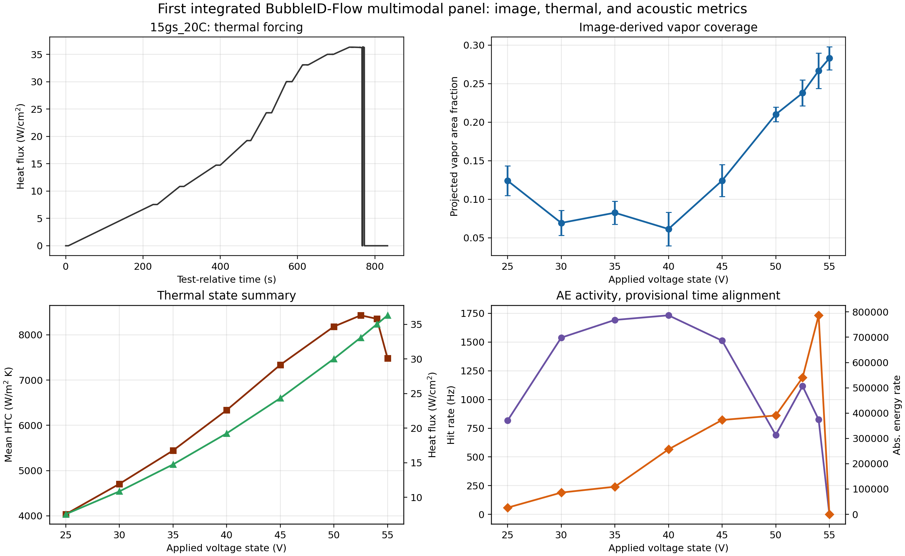
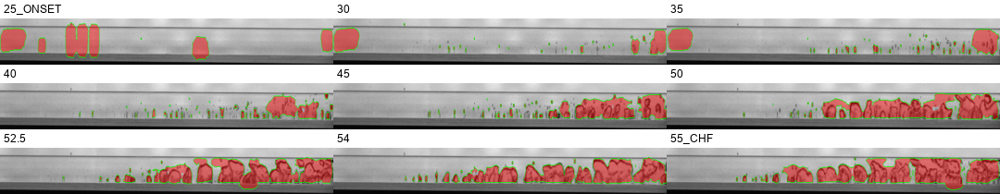
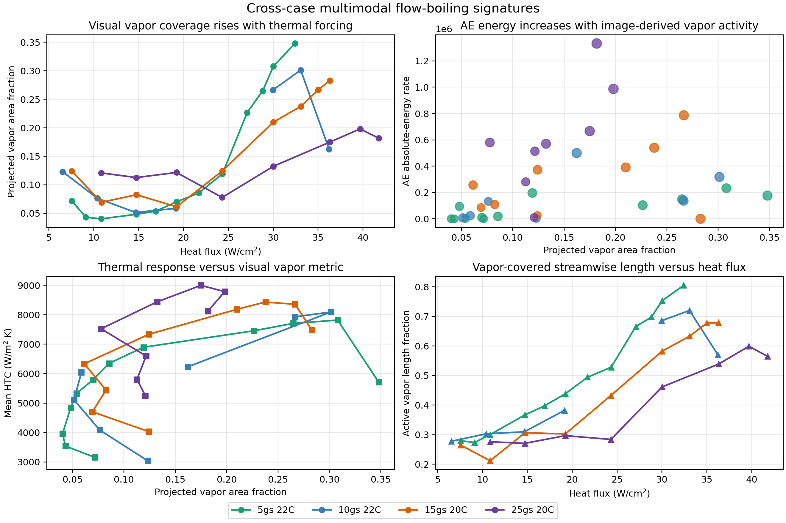
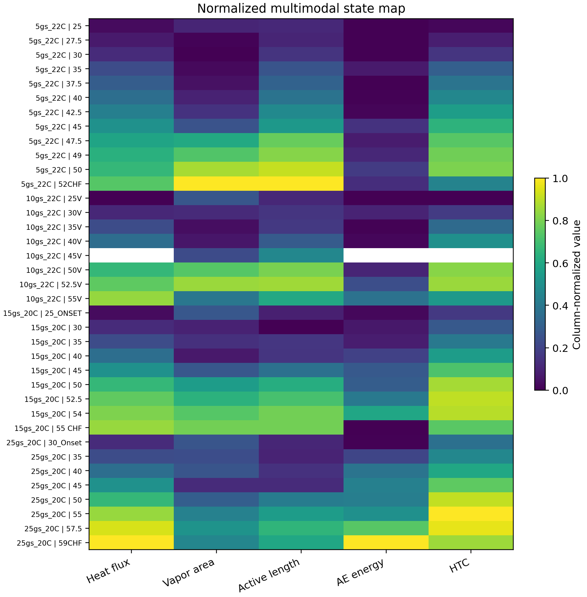

# Multimodal Diagnostics of Flow Boiling Using BubbleID-Flow, Acoustic Emission, and Thermal Measurements

## Authors

Mohammad Ishraq Hossain, Daniel Curl, Farshad Barghi Golezani, Han Hu, and collaborators.

## Abstract

Flow boiling experiments generate coupled visual, thermal, and acoustic signatures, but these data streams are often analyzed separately. This manuscript develops a preliminary multimodal workflow that combines computer-vision bubble segmentation, acoustic-emission features, and reduced thermal-fluid measurements from heated microchannel flow boiling tests. BubbleID-Flow, a flow-boiling adaptation of BubbleID, is used to segment bubbles from high-speed images and compute projected vapor area fraction and vapor-covered streamwise length. These image-derived metrics are fused with heat flux, local heat-transfer coefficient, pressure-drop-related quantities, and acoustic-emission hit/energy metrics for four operating cases: `5gs_22C`, `10gs_22C`, `15gs_20C`, and `25gs_20C`. In the baseline `15gs_20C` case, projected vapor area fraction increases from low values at onset and intermediate states to approximately `0.28` near the CHF-adjacent state, while heat flux rises to approximately `36 W/cm2`. Cross-case synthesis shows that vapor coverage and vapor-covered streamwise length generally increase with heat flux, and acoustic absolute-energy rate broadly increases with image-derived vapor activity. The result is a reproducible analysis framework for linking optical vapor morphology, nonintrusive acoustic sensing, and thermal performance in flow boiling. The present analysis is preliminary because image/thermal/acoustic synchronization and segmentation uncertainty require further audit before quantitative lead-lag or prediction claims are made.

## 1. Introduction

Flow boiling is attractive for high-heat-flux thermal management because latent heat transport and bubble-induced mixing can remove large heat loads from compact heated surfaces. The same coupled physics also make flow boiling difficult to model and diagnose: local wall temperature, vapor distribution, pressure drop, and interfacial dynamics evolve together, especially near onset and CHF-adjacent conditions. A manuscript based only on thermal data risks missing the mechanisms behind changes in heat-transfer coefficient, while a manuscript based only on visualization risks underusing the available heat-transfer and acoustic information.

Prior work by Kharangate and collaborators has established a strong foundation for flow-boiling heat transfer, CHF mechanisms, visualization, and modeling in rectangular or microchannel configurations. The Case Western Reserve University Two-Phase Flow and Thermal Management Lab publication list includes recent studies on flow-boiling CHF and heat transfer with one-sided heating, PIV-based investigation of flow during flow boiling, and machine-learning boiling prediction from autonomous vision data. BubbleMask and related autonomous-vision studies show how high-speed images can be transformed into physically meaningful bubble features for flow-boiling prediction. In parallel, acoustic-emission approaches have been developed for phase-change diagnostics. NASA's "Acoustic Insights into Flow Condensation Mechanisms" project describes acoustic, modal, optical, and thermofluidic sensing for detecting condensation regime transitions, and recent APS work from Sun and collaborators focuses on AE sensing for flow condensation regime identification and local heat-transfer characterization.

The present work is distinguished from those streams by integrating all three diagnostic modalities in the same flow-boiling analysis. It is not only a visual bubble-extraction paper, and it is not only an acoustic-sensing paper. The intended contribution is a fused workflow in which BubbleID-Flow provides spatial vapor metrics, acoustic emission provides high-bandwidth signatures of interfacial activity, and reduced thermal data provide heat-transfer context. This multimodal framing is especially useful for building diagnostic indicators that can be robust when one modality is limited, for example when optical access is restricted or when AE signals require physical interpretation.

## 2. Experimental Data and Test Matrix

The current analysis uses October 17, 2025 CWRU Test 17 data from a heated microchannel two-phase flow loop with high-speed imaging and acoustic-emission sensing. The working fluid is deionized water. Four main operating cases are analyzed:

| Case | Nominal mass flow rate | Nominal inlet subcooling | Test folder |
| --- | ---: | ---: | --- |
| `5gs_22C` | 5 g/s | 22 degC | `2` |
| `10gs_22C` | 10 g/s | 22 degC | `1` |
| `15gs_20C` | 15 g/s | 20 degC | `3` |
| `25gs_20C` | 25 g/s | 20 degC | `4` |

The image folders are organized by applied-voltage or transition state, including onset and CHF-adjacent labels. The reduced thermal workbooks contain time, mass flow rate, fluid velocity, power, total heat flux, inlet subcooling, pressures, saturation temperature, local temperatures at seven streamwise locations, vapor quality estimates, and heat-transfer coefficient estimates. Acoustic-emission files include EasyAE hit features such as hit count, duration, amplitude, RMS, frequency metrics, and absolute energy. The current analysis uses the hit-based acoustic features for the first integrated manuscript pass.

## 3. Methods

### 3.1 BubbleID-Flow Image Analysis

BubbleID-Flow uses a Detectron2 Mask R-CNN model fine-tuned from manually annotated flow-boiling images. The present model analyzes a near-wall ROI defined as `0,485,1024,70`, which focuses on the region where vapor structures are visible in the current camera view. For each image, the model produces instance masks that are combined into a binary projected vapor mask. The principal image-derived metric is the projected vapor area fraction,

```text
alpha_A = bubble-mask pixels / total ROI pixels.
```

The analysis also computes an active vapor length fraction by identifying streamwise columns whose local vapor occupancy exceeds a small threshold. This quantity estimates the fraction of the field of view containing appreciable vapor activity.

### 3.2 Thermal Analysis

Thermal state summaries are obtained from the reduced Excel workbooks. The image-folder voltage labels are matched to thermal rows using the absolute voltage in the thermal input workbook with a tolerance of `±0.75 V`. For each matched state, the workflow calculates mean heat flux, mean power, mean inlet subcooling, mean pressure drop, mean heat-transfer coefficient across the seven streamwise locations, and downstream vapor quality estimate.

### 3.3 Acoustic-Emission Analysis

The first-pass acoustic analysis uses EasyAE hit tables. The script parses the hit file after the EasyAE header and computes hit rate, channel-specific hit rate, mean amplitude, and absolute-energy rate over thermal voltage windows. This alignment is provisional because the exact trigger/timestamp relationship between imaging, thermal acquisition, and AE acquisition still needs to be verified. Therefore, this manuscript draft interprets AE trends as operating-state-matched signatures rather than precise temporal lead/lag behavior.

### 3.4 Multimodal Fusion

For each operating state, image, thermal, and acoustic metrics are merged into a state-level table. The workflow produces two levels of analysis: a baseline case figure for `15gs_20C` and cross-case synthesis figures for all four operating cases. The baseline figure demonstrates the full data pipeline, while the cross-case figure tests whether the same trends persist across mass flow rate and subcooling conditions.

## 4. Results

### 4.1 Baseline Case: `15gs_20C`

The baseline `15gs_20C` case shows a clear progression from lower vapor coverage at onset/intermediate states to stronger vapor coverage near the CHF-adjacent state. In the current sampled-frame analysis, the projected vapor area fraction ranges from approximately `0.061` to `0.283`, while heat flux ranges from approximately `7.55` to `36.30 W/cm2`. The representative overlays show that the vapor-covered region expands downstream as voltage increases.



The integrated panel links this visual growth to the thermal and acoustic measurements. Mean heat-transfer coefficient increases through much of the sweep and then changes near the highest-voltage state, while AE activity varies strongly over the same operating range. The AE absolute-energy rate increases toward high-voltage states but drops in the final `55 CHF` window in the current provisional alignment, likely because the matched time window includes shutdown or transition behavior. This point is a useful warning: the acoustic signal is promising, but synchronization must be audited before interpreting exact state transitions.



### 4.2 Cross-Case Multimodal Trends

Across all four cases, projected vapor area fraction generally increases with heat flux, and active vapor length fraction also increases with heat flux. The `5gs_22C` case shows the largest visual vapor coverage in the current analysis, reaching approximately `0.348`, while `25gs_20C` reaches the highest heat flux, approximately `41.76 W/cm2`, with lower projected vapor coverage in the camera ROI. This difference is physically plausible because increasing mass flow can remove vapor more effectively and shift the relationship between vapor coverage and heat input.



The AE absolute-energy rate broadly increases with image-derived vapor activity, but the scatter is substantial. This scatter should not be viewed as a failure of acoustic sensing; it likely reflects the fact that AE amplitude and energy depend on sensor coupling, flow structure, impact/oscillation mechanisms, and the time-window alignment. A valuable manuscript contribution is therefore not a single correlation coefficient, but a physically grounded comparison showing where visual vapor metrics and AE metrics agree, where they diverge, and what this divergence suggests about the sensing mechanism.



### 4.3 What the Multimodal Analysis Adds

The visual data identify where vapor is present in the near-wall field of view. The thermal data quantify the energetic forcing and heat-transfer response. The AE data capture high-bandwidth mechanical/interfacial activity that is not visible in a single optical frame. The combination is more informative than any one modality alone: vapor coverage can rise with heat flux, HTC can plateau or decline near transition, and AE energy can reveal intermittent or violent events that are not fully captured by time-averaged image metrics.

## 5. Discussion

The current results support the feasibility of multimodal boiling diagnostics, but several limitations must be addressed before journal submission. First, BubbleID-Flow segmentation is still an early model trained on limited annotations. It performs well enough for projected vapor coverage trends, but individual bubble counts and sizes remain less reliable because dense bubbles can merge and onset-state false positives occur. Second, AE-to-thermal alignment is provisional. A trigger audit is needed to determine whether the AE windows correspond exactly to image and thermal states. Third, image-derived vapor fraction is a 2D projected area metric, not a calibrated 3D void fraction.

These limitations define a productive next phase rather than weakening the manuscript. A strong final paper can frame the present workflow as a reproducible bridge between computer vision, acoustic sensing, and thermal reduction. The distinctive contribution is the integration and comparison of the modalities, not the claim that any single metric is complete.

## 6. Conclusions

1. A BubbleID-Flow Mask R-CNN model can convert high-speed flow-boiling images into projected vapor area fraction and vapor-covered streamwise length metrics.
2. In the baseline `15gs_20C` case, projected vapor area fraction increases from approximately `0.061` to `0.283` as heat flux increases from approximately `7.55` to `36.30 W/cm2`.
3. Cross-case analysis shows that projected vapor coverage and active vapor length generally rise with thermal forcing across the four operating cases.
4. AE absolute-energy rate broadly increases with image-derived vapor activity, but case-specific scatter and the final CHF-adjacent windows show that synchronization and acoustic transfer mechanisms must be treated carefully.
5. The integrated workflow distinguishes this study from vision-only flow-boiling analysis and acoustic-only condensation diagnostics by fusing optical, thermal, and AE signatures in a single flow-boiling dataset.

## 7. Immediate Work Before Submission

- Verify image, thermal, and AE synchronization using trigger records or acquisition metadata.
- Increase image sampling from 6-8 frames per state to complete image sequences or statistically justified samples.
- Add manual segmentation validation for representative states.
- Audit thermal data reduction equations and uncertainty.
- Refine acoustic features with waveform-derived band power or spectrogram metrics for selected states.
- Replace preliminary figures with publication-formatted versions.

## References and Positioning Sources

1. Kharangate lab publication list, including flow boiling/CHF, PIV flow boiling, BubbleMask, and machine-learning boiling prediction work: https://case.edu/engineering/labs/tpftml/publications
2. Huang et al., "Machine Learning Boiling Prediction: From Autonomous Vision of Flow Visualization Data to Performance Parameter Theoretical Modeling," listed at Case Western Reserve University: https://commons.case.edu/facultyworks/1320/
3. Shingote et al., "Investigation of Flow Boiling Critical Heat Flux and Heat Transfer Within a Horizontally Oriented Channel With One-Sided Heating at Three Levels of Subcooled Inlet," Case Western Reserve University: https://commons.case.edu/facultyworks/1100/
4. NASA NTRS, "Acoustic Insights into Flow Condensation Mechanisms": https://ntrs.nasa.gov/citations/20250000264
5. APS DFD 2025 abstract, "Acoustic Sensing for Regime Identification and Local Heat Transfer Characterization of Flow Condensation": https://meetings-archive.aps.org/dfd/2025/k38/10/
